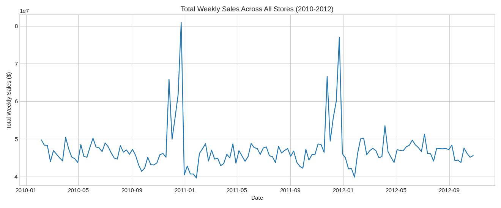
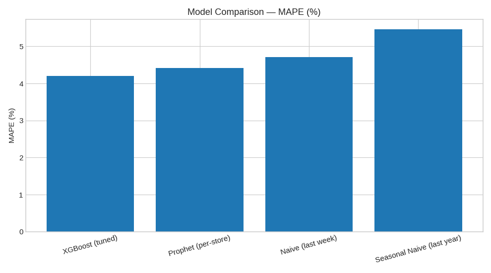

# 🛒 Walmart Sales Forecasting & Optimization

> End-to-end time-series forecasting project: from raw retail data to a deployed, interactive sales prediction app.

[](https://www.python.org/)
[](https://streamlit.io/)
[](https://mlflow.org/)
[](LICENSE)

🔗 **Live Demo:** _[Streamlit app link — add after deployment]_
📊 **Kaggle Notebook:** _[Kaggle notebook link — add after publishing]_

---

## 📌 Project Overview

This project predicts weekly sales for 45 Walmart stores using historical sales data, economic indicators (CPI, Unemployment, Fuel Price), and holiday effects. The goal is to provide a forecasting tool that helps optimize inventory, marketing, and staffing decisions.

**Dataset:** [Walmart Dataset (Kaggle)](https://www.kaggle.com/datasets/yasserh/walmart-dataset)

---

## 🎯 Key Results

Evaluated on a held-out 12-week test set (time-based split — no random shuffling, since this is time-series data):

| Model | RMSE | MAE | MAPE |
|---|---|---|---|
| Naive (last week) | 72,442 | 46,966 | 4.71% |
| Seasonal Naive (last year) | 85,366 | 53,769 | 5.46% |
| Prophet (per-store) | 61,954 | 42,730 | 4.42% |
| **XGBoost (tuned)** | **61,216** | **40,735** | **4.20%** |

**XGBoost** was selected as the final model — it combines store-level differences with recency/seasonality features (`lag_52`, `rolling_mean_4`) better than the per-store Prophet models or naive baselines. Full comparison and methodology in [`notebooks/03_modeling.ipynb`](notebooks/03_modeling.ipynb).

<p align="center">
  
  <br><em>Total weekly sales across all 45 stores (2010–2012), showing a clear December seasonal spike.</em>
</p>

<p align="center">
  
  <br><em>MAPE comparison across all evaluated models.</em>
</p>

---

## 🗂️ Project Structure

```
walmart-sales-forecasting/
├── data/
│   ├── raw/              # Original, untouched dataset
│   └── processed/        # Cleaned & feature-engineered data
├── notebooks/            # EDA, modeling, experimentation notebooks
├── src/                  # Reusable Python modules (cleaning, features, models)
├── app/                  # Streamlit application
├── models/               # Saved/serialized final model(s)
├── reports/
│   └── figures/          # Exported charts for the report/README
├── mlruns/                # MLflow experiment tracking (gitignored if large)
├── requirements.txt
└── README.md
```

---

## 🚀 How to Run Locally

```bash
# 1. Clone the repo
git clone https://github.com/<your-username>/walmart-sales-forecasting.git
cd walmart-sales-forecasting

# 2. Create a virtual environment
python -m venv venv
source venv/bin/activate  # Windows: venv\Scripts\activate

# 3. Install dependencies
pip install -r requirements.txt

# 4. Launch the app
streamlit run app/app.py
```

---

## 🧭 Methodology (Milestones)

1. **Data Collection, Exploration & Preprocessing** — EDA, missing values, time-based feature engineering ([`notebooks/01_data_exploration.ipynb`](notebooks/01_data_exploration.ipynb))
2. **Data Analysis & Visualization** — correlation analysis, seasonal decomposition, interactive Plotly dashboard ([`notebooks/02_visualization_dashboard.ipynb`](notebooks/02_visualization_dashboard.ipynb))
3. **Forecasting Model Development & Optimization** — Naive baselines, Prophet, and XGBoost (tuned with `TimeSeriesSplit`) compared on a time-based holdout ([`notebooks/03_modeling.ipynb`](notebooks/03_modeling.ipynb))
4. **MLOps, Deployment & Monitoring** — MLflow experiment tracking, Streamlit deployment, monitoring plan ([`reports/MLOps_Report.md`](reports/MLOps_Report.md))
5. **Final Documentation & Presentation** — this README + final report

---

## 🛠️ Tech Stack

`Python` `Pandas` `Scikit-learn` `Prophet` `XGBoost` `Statsmodels` `Plotly` `Streamlit` `MLflow`

---

## 📈 Business Value

Accurate weekly sales forecasts allow retail teams to:
- Optimize inventory levels and reduce stockouts/overstock
- Plan staffing and promotions around predicted demand peaks (holidays)
- Detect early warning signs of demand shifts via monitoring

---

## 👤 Author

**Tareq Elnaggar** — Data Scientist
[LinkedIn](https://www.linkedin.com/in/tarek-mohamed-el-naggar/) · [Kaggle](https://www.kaggle.com/tarekelnaggar) · [GitHub](https://github.com/tito644)

---

## 📄 License

This project is licensed under the MIT License — see [LICENSE](LICENSE) for details.
